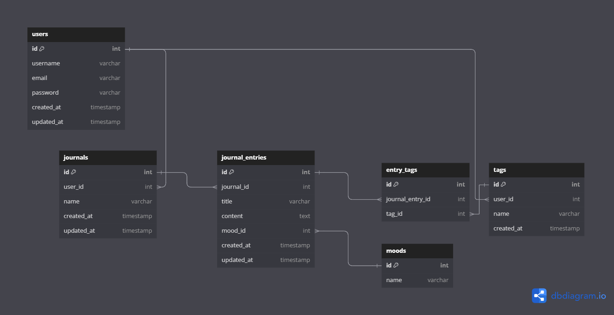
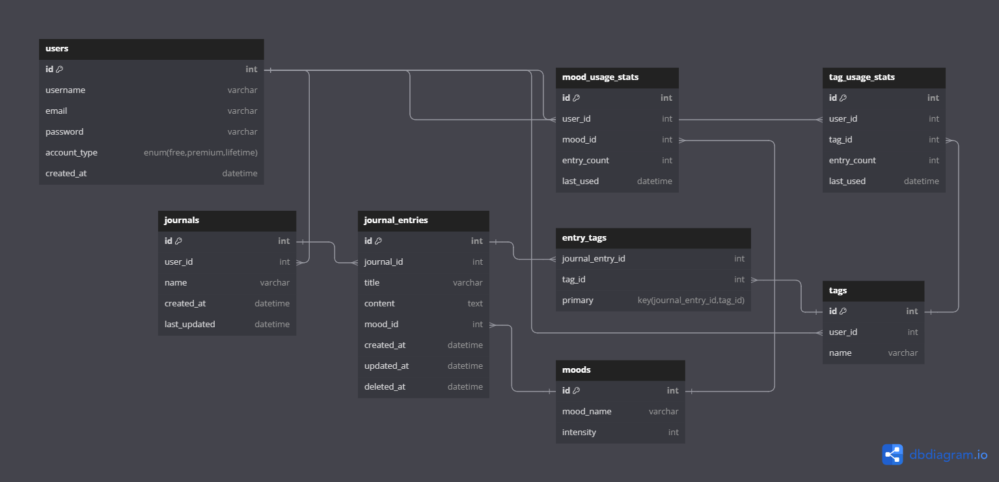

# Entity-Relationship Diagrams

**ERD**s are a graphical representation of the entities in a system and the relationships between those entities.

## Pre-Development ERDs

While this design effectively addresses the core requirements of the journaling app, several areas warrant improvement for enhanced scalability, performance, and user experience. First, this implementation restricts flexibility with regards to moods - there's no support for associating multiple moods to a single entry or capturing mood intensity (i.e slightly happy vs extremely happy). Data retrieval may slow down over time when querying for heavily tagged entries and searching through multiple entries. Additionally, the absence of role-based access prevents collaborative features, such as two people contributing to one entry. Furthermore, there is no mechanism to track revisions that may come later, similar to git, which could enlighten users to see how their thoughts evolved. Data-related issues could arise without soft deletes, which should be integrated to facilitate recovery of deleted entries. In this iteration, a deleted journal entry cannot be recovered.

| **Pros**                                                     | **Cons**                                                    |
|--------------------------------------------------------------|-------------------------------------------------------------|
| Custom named journals                                        | Absence of a role-based access control for shared journals  |
| Users can create multiple journals                           | No soft delete functionality                                |
| User-defined tags for entries                                | Costly queries on tag and mood usage trends                 |
| Supports mood tracking for entries                           | Inadequate options for multi-mood entries or intensity      |
| Suitable for basic journaling needs                          | Lacks version control for entries                           |

---

The transition from the **initial attempt** to the **second design** reflects incremental adjustments, focusing on improved functionality and user experience. One of the major changes is the shift from costly queries on usage trends to pre-aggregated tables. The introduction of `tag_usage_stats` and `mood_usage_stats` provides valuable insights into journaling habits without the high query cost of recomputing data from scratch. Mood tracking has also been improved with the addition of an `intensity` field, allowing for a nuanced representation of emotional states. The incorporation of soft deletes via the `deleted_at` field in the `journal_entries` table allows users to recover entries that would have been a permanent loss with the previous design. Furthermore, the introduction of a composite primary key for the `entry_tags` table ensures the uniqueness of each entry-tag relationship, preventing data duplication. The second design now supports various user account types—free, premium, and lifetime—in the `users` table, opening up possibilities for tiered features and monetization strategies. The evolution from the initial attempt to the second design showcases a thoughtful response to user needs, resulting in a more robust, user-friendly, and scalable journaling app.

| **Pros**                                                   | **Cons**                                                    |
|------------------------------------------------------------|-------------------------------------------------------------|
| Custom named journals                                      | Absence of a role-based access control for shared journals  |
| Users can create multiple journals                         | Complex join queries, possible bottlenecks at scale         |
| User-defined tags for entries                              | Lacks version control for entries                           |
| Granular mood tracking for entries                         | Increased overall storage requirements                      |
| Easier analytical insights                                 | Potential redundant data in related `usage_stats`           |               
| Soft delete functionality                                  | Possible over-engineering, before significant returns       |